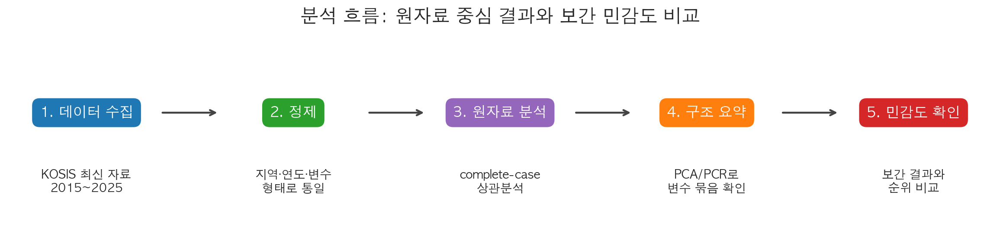
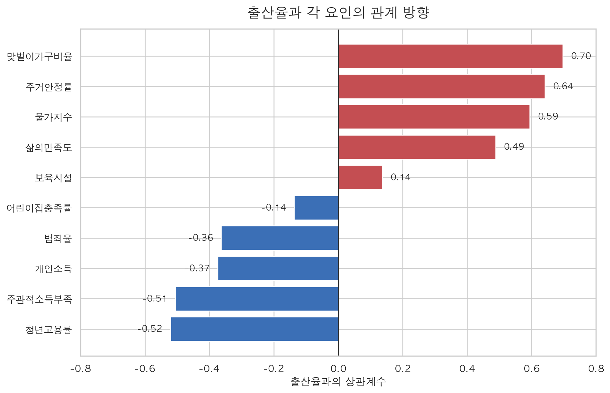
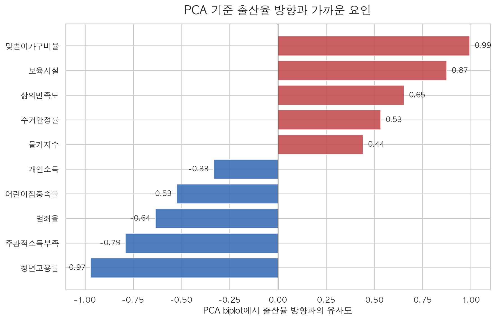

# Population Data Analysis

KOSIS 최신 시도별 데이터를 사용해 **합계출산율과 사회·경제 요인의 관계**를 탐색한 데이터 분석 프로젝트입니다.
원자료 중심 분석을 기본으로 두고, 보간 민감도 비교를 함께 수행해 결측 처리 방식에 따라 결과가 얼마나 달라지는지 확인했습니다.



## 바로가기

| 구분 | 링크 |
| --- | --- |
| 최종 보고서 | [분석 결과 보고서](reports/final_correlation_report.md) |
| 실행 결과 노트북 | [결과 포함 노트북](population_analysis_assignment_result.ipynb) |
| 분석용 노트북 | [분석 노트북](population_analysis_assignment.ipynb) |
| 코드 | [src/](src/) |
| 원본 데이터 | [data/](data/) |
| 생성된 시각 자료 | [reports/figures/](reports/figures/) |

## 코드 구성

| 파일 | 역할 |
| --- | --- |
| [결과 포함 노트북](population_analysis_assignment_result.ipynb) | 데이터 정제, 요인별 추출, 상관분석, PCA/PCR, 보간 비교가 실행된 노트북 |
| [분석 노트북](population_analysis_assignment.ipynb) | 같은 분석 흐름을 재실행할 수 있는 노트북 |
| [노트북 생성 스크립트](src/create_population_analysis_notebook.py) | 분석 노트북 구조를 생성하는 스크립트 |
| [보고서 시각화 스크립트](src/generate_report_visuals.py) | 최종 보고서에 들어가는 PNG 시각 자료를 재생성하는 스크립트 |

## 프로젝트 질문

출산율은 한 가지 요인만으로 설명하기 어렵습니다. 이 프로젝트는 시도별 합계출산율이 다음 요인들과 어떤 방향으로 함께 움직이는지 확인합니다.

- 보육시설, 어린이집 정현원/충족률
- 주거안정률
- 삶의 만족도
- 주관적 소득부족
- 맞벌이 가구
- 물가지수
- 범죄율
- 청년고용률
- 개인소득

## 데이터 출처

원자료는 KOSIS 국가통계포털에서 내려받은 엑셀 파일을 사용했습니다.

- 공식 출처: [KOSIS 국가통계포털](https://kosis.kr/statisticsList/statisticsListIndex.do?vwcd=MT_ZTITLE&menuId=M_01_01)
- 로컬 원자료: [data/](data/)
- 참고 방법론: [OpenAI Codex 데이터셋·리포트 튜토리얼](https://developers.openai.com/codex/use-cases/datasets-and-reports)

사용한 주요 데이터 파일은 `data/` 폴더에 있으며, 파일명에 기간이 함께 표시되어 있습니다. 예를 들어 출산율·삶의 만족도·물가·청년고용률 등은 2025년 자료를 포함하고, 보육시설·개인소득·맞벌이 가구 등은 2024년까지의 자료를 사용합니다.

## 분석 흐름

1. KOSIS 엑셀 데이터를 수집하고 파일별 기간, 단위, 최신 연도를 확인했습니다.
2. 지역명과 연도 형식을 맞춰 `지역-연도-변수` 형태의 패널 데이터로 정리했습니다.
3. 결측을 먼저 확인하고, 원자료만 사용하는 complete-case 분석을 메인으로 수행했습니다.
4. 출산율과 각 요인의 단순 상관관계를 확인했습니다.
5. PCA/PCR로 여러 요인이 함께 움직이는 구조를 요약했습니다.
6. 보간 적용 버전을 따로 만들어 complete-case 결과와 비교했습니다.
7. 최종 보고서에는 complete-case 결과를 주 결론으로 두고, 보간 결과는 민감도 확인으로 제시했습니다.

## 방법론과 선택 이유

| 방법 | 원리 | 선택 이유 |
| --- | --- | --- |
| complete-case 분석 | 결측이 없는 공통 지역·연도만 사용 | 실제 관측값 중심이라 임의 대체에 따른 왜곡을 줄일 수 있습니다. |
| 상관분석 | 두 변수가 같은 방향 또는 반대 방향으로 움직이는 정도를 계산 | 일반인이 결과를 직관적으로 이해하기 쉽고, 출산율과 각 요인의 관계를 빠르게 비교할 수 있습니다. |
| PCA | 여러 변수를 몇 개의 큰 축으로 압축 | 주거, 소득, 고용, 물가처럼 서로 얽힌 지표를 함께 요약할 수 있습니다. |
| PCR | PCA로 만든 축을 이용해 출산율과의 관계를 회귀적으로 확인 | 변수 간 상관이 높은 상황에서 단순 회귀보다 안정적으로 방향성을 볼 수 있습니다. |
| 보간 민감도 분석 | 내부 결측은 선형 보간, 양끝 결측은 시도 평균·전체 평균으로 대체 | 결측 처리 방식에 따라 결론이 바뀌는지 확인하기 위한 보조 분석입니다. |

## 핵심 결과 요약

complete-case 분석에서는 **맞벌이가구비율, 보육시설, 삶의만족도**가 출산율 방향과 가장 가깝게 나타났습니다.

단순 상관관계에서는 맞벌이, 주거안정, 물가, 삶의 만족이 출산율과 양의 관계를 보였고, 청년고용률, 주관적 소득부족, 개인소득, 범죄율은 음의 관계를 보였습니다. 다만 이 결과는 인과관계가 아니라 지역 단위에서 함께 움직이는 경향을 본 것입니다.

보간 분석에서는 주거안정률과 물가지수의 중요도가 올라갔습니다. 따라서 complete-case 결과를 중심으로 해석하되, 보간 결과는 “주거와 생활비 요인이 결측 처리 방식에 민감하게 나타난다”는 보조 근거로 보는 것이 적절합니다.

자세한 표, 그래프, 해석은 [최종 보고서](reports/final_correlation_report.md)에서 확인할 수 있습니다.

## 주요 시각화

| 상관관계 | PCA/PCR 영향 요인 |
| --- | --- |
|  |  |

## 실행 방법

노트북을 직접 실행하려면 Jupyter 환경에서 아래 파일을 열면 됩니다.

- [분석 노트북](population_analysis_assignment.ipynb)
- [결과 포함 노트북](population_analysis_assignment_result.ipynb)

보고서용 그림을 다시 생성하려면 다음 명령을 실행합니다.

```bash
python3 src/generate_report_visuals.py
```

필요한 주요 패키지는 `pandas`, `numpy`, `matplotlib`, `seaborn`, `scikit-learn`, `openpyxl`입니다.

## 해석 시 주의점

- 이 분석은 시도 단위 자료를 사용하므로 개인의 출산 결정을 직접 설명하지 않습니다.
- 상관관계는 인과관계가 아닙니다.
- 2025년 잠정치가 있는 지표는 최신 현황 그래프에 사용했지만, 모든 요인을 통합하는 PCA/PCR에는 억지로 맞춰 넣지 않았습니다.
- 보간 버전은 결론의 주 근거가 아니라 결과 안정성 확인용입니다.
