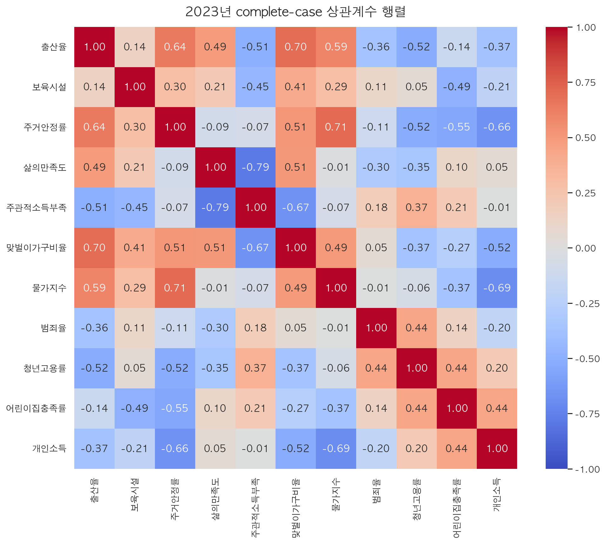
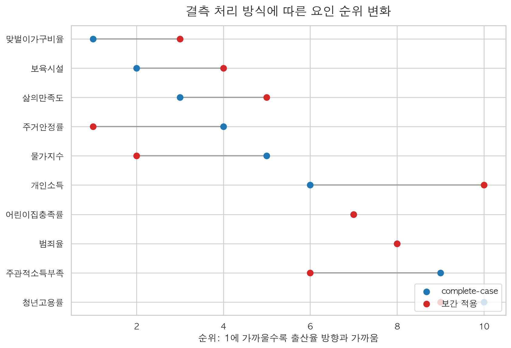

# 인구분석 과제 최종 보고서

## 한눈에 보는 결론

이 보고서는 시도별 합계출산율과 사회·경제 요인의 관계를 살펴본 탐색적 분석이다. 결론부터 말하면, **강의자료 방식의 complete-case 분석에서는 `맞벌이가구비율`, `보육시설`, `삶의만족도`가 출산율 방향과 가장 가깝게 나타났다.** 단순 상관관계로는 `맞벌이가구비율`, `주거안정률`, `물가지수`, `삶의만족도`가 출산율과 같은 방향으로 움직였고, `청년고용률`, `주관적소득부족`, `개인소득`, `범죄율`은 반대 방향으로 움직였다.

다만 이 결과는 인과관계가 아니라 **상관관계와 영향 가능성**을 비교한 것이다. 그래서 본 보고서는 원자료만 사용한 분석을 메인 결과로 두고, 보간을 적용한 결과는 “결측 처리에 따라 결론이 얼마나 바뀌는지” 확인하는 보조 결과로 제시한다.

## 분석 흐름과 방법

분석은 다섯 단계로 진행했다. 먼저 KOSIS에서 출산율과 관련 요인 데이터를 수집하고, 모든 자료를 `지역-연도-변수` 형태로 맞췄다. 그 다음 결측이 없는 공통 연도 자료를 중심으로 상관분석을 수행했다. 이후 PCA/PCR을 사용해 변수들이 함께 움직이는 구조를 요약했고, 마지막으로 보간을 적용한 결과와 비교해 결론의 안정성을 확인했다.

### 왜 complete-case를 메인으로 삼았나

complete-case 분석은 결측값을 억지로 채우지 않고 실제 관측된 값만 사용한다. 교수님 강의자료의 방식과 가장 가깝고, 과제에서 설명하기에도 가장 안전하다. 단점은 자료가 있는 연도와 지역만 남기기 때문에 표본 수가 줄 수 있다는 점이다.

### 왜 상관분석을 했나

상관분석은 출산율과 각 요인이 **같은 방향으로 움직이는지, 반대 방향으로 움직이는지**를 가장 직관적으로 보여준다. 예를 들어 상관계수가 양수면 두 변수가 대체로 함께 증가하거나 감소하는 경향이 있고, 음수면 한 변수가 높을 때 다른 변수가 낮은 경향이 있다. 일반인이 보기에도 “어떤 요인이 출산율과 가까운가”를 빠르게 파악할 수 있어 첫 분석으로 적합하다.

### 왜 PCA/PCR을 적용했나

출산율 관련 요인은 서로 독립적이지 않다. 예를 들어 주거, 물가, 소득, 고용, 삶의 만족도는 서로 얽혀 있을 수 있다. PCA는 이런 여러 변수를 몇 개의 큰 축으로 요약해 변수들이 어떤 방향으로 함께 움직이는지 보여준다. PCR은 PCA로 정리한 축을 이용해 출산율과의 관계를 다시 보는 방법이다. 이 방식은 변수가 많고 서로 비슷하게 움직일 때, 단순 회귀보다 해석이 안정적일 수 있다.

### 왜 보간 분석도 했나

일부 변수는 2025년까지 있고, 일부 변수는 2024년까지만 있다. 결측을 모두 버리면 최신 흐름을 충분히 보지 못할 수 있다. 그래서 선형 보간과 평균 대체를 적용한 보조 분석을 추가했다. 다만 보간값은 실제 관측값이 아니므로, 보간 분석은 결론의 주 근거가 아니라 **민감도 확인용**으로만 사용했다.

## complete-case 기준 상관관계

2023년 complete-case 상관계수 행렬은 아래와 같다. 붉은색은 양의 관계, 푸른색은 음의 관계를 뜻한다. 색이 진할수록 관계가 강하다.

출산율과 각 요인의 관계만 따로 보면 다음과 같다.

| 변수 | 출산율과의 상관계수 | 해석 |
| --- | ---: | --- |
| 맞벌이가구비율 | 0.697 | 출산율과 가장 강한 양의 관계 |
| 주거안정률 | 0.641 | 안정적 주거 기반과 출산율이 함께 움직임 |
| 물가지수 | 0.594 | 지역 생활수준·도시 특성과 함께 움직였을 가능성 |
| 삶의만족도 | 0.488 | 생활 만족과 출산율의 같은 방향 관계 |
| 청년고용률 | -0.522 | 대도시·고용기회·주거부담이 섞인 결과로 주의 필요 |
| 주관적소득부족 | -0.506 | 소득 부족 체감이 높을수록 출산율이 낮은 경향 |

상관분석에서 가장 눈에 띄는 점은 `맞벌이가구비율`, `주거안정률`, `삶의만족도`가 출산율과 비교적 같은 방향으로 움직였다는 것이다. 이는 출산이 단순히 소득 하나로 결정되는 것이 아니라, 일과 가정의 양립 가능성, 안정적인 주거 기반, 생활 만족감과 함께 해석될 필요가 있음을 보여준다.

반대로 `청년고용률`과 `개인소득`이 음의 관계를 보인 점은 조심해서 해석해야 한다. 소득과 고용이 출산율을 낮춘다는 뜻이 아니라, 소득과 고용 기회가 큰 지역일수록 주거비, 경쟁, 만혼, 양육비 부담도 함께 클 수 있기 때문이다.

## PCA/PCR 기준 영향 요인

PCA 기준으로 출산율 방향과 가까운 요인을 시각화하면 다음과 같다. 오른쪽으로 갈수록 출산율 방향과 비슷하게 움직인 요인이고, 왼쪽으로 갈수록 반대 방향에 가까운 요인이다.

| 순위 | 변수 | PCA 유사도 | PCR 계수 |
| ---: | --- | ---: | ---: |
| 1 | 맞벌이가구비율 | 0.993 | 0.028 |
| 2 | 보육시설 | 0.875 | -0.020 |
| 3 | 삶의만족도 | 0.653 | 0.024 |
| 4 | 주거안정률 | 0.533 | 0.018 |
| 5 | 물가지수 | 0.441 | 0.019 |

complete-case 기준 상위 요인은 **맞벌이가구비율, 보육시설, 삶의만족도** 순이다. 여기서 `보육시설`은 단순 상관계수만 보면 높지 않지만, PCA에서는 출산율 방향과 가까운 축에 위치했다. 이는 보육시설이 단독으로 출산율을 설명한다기보다, 보육 환경·가족 정책·지역 생활 여건과 함께 움직이는 요인일 가능성을 보여준다.

PCR 계수는 표준화와 주성분 변환 이후의 계수이므로 단순하게 “이 변수가 증가하면 출산율이 오른다”라고 말하면 안 된다. 대신 여러 변수를 함께 고려했을 때 출산율 방향과 가까운 변수 묶음을 확인하는 용도로 해석하는 것이 적절하다.

## 보간 분석과 결과 안정성

결측을 보간한 결과에서는 일부 순위가 바뀌었다. 아래 그림은 complete-case 순위와 보간 적용 순위를 나란히 비교한 것이다. 점 사이의 선이 길수록 결측 처리 방식에 따라 순위가 많이 달라진 변수다.

| 변수 | complete-case 순위 | 보간 적용 순위 | 변화 |
| --- | ---: | ---: | ---: |
| 주거안정률 | 4 | 1 | -3 |
| 물가지수 | 5 | 2 | -3 |
| 맞벌이가구비율 | 1 | 3 | 2 |
| 보육시설 | 2 | 4 | 2 |
| 삶의만족도 | 3 | 5 | 2 |

보간 적용 후에는 `주거안정률`과 `물가지수`의 순위가 올라갔다. 이는 complete-case 분석에서도 주거와 물가가 무시할 수 없는 관계를 보였고, 결측 연도를 보강해 2024년 자료까지 보면 주거·생활비 축의 설명력이 더 커질 수 있음을 뜻한다.

다만 보간 분석은 실제 관측값만으로 이루어진 결과가 아니다. 따라서 발표에서는 `complete-case 결과`를 메인 결론으로 두고, 보간 결과는 “주거와 물가 요인이 결측 처리에 민감하게 나타났다”는 보조 설명으로 제시하는 것이 좋다.

## 가능한 원인 해석

첫째, **맞벌이가구비율**은 complete-case에서 가장 높은 순위로 나타났다. 맞벌이가구비율이 높은 지역은 여성의 경제활동과 가족 형성이 함께 가능한 환경이거나, 가계의 경제적 안정성이 비교적 높은 지역일 수 있다. 다만 맞벌이 자체가 출산율을 직접 높인다고 단정하기보다, 노동시장·돌봄 인프라·생활 안정성이 함께 반영된 복합 지표로 해석한다.

둘째, **주거안정률**은 상관분석과 보간 분석 모두에서 중요하게 나타났다. 결혼과 출산은 장기 거주 계획과 밀접하기 때문에, 자가 또는 무상 거주처럼 안정적인 주거 기반이 있는 지역에서 출산율이 상대적으로 높게 나타날 가능성이 있다.

셋째, **삶의만족도**는 출산 결정이 단순히 경제 지표만으로 설명되지 않는다는 점을 보여준다. 지역 생활의 만족감, 미래에 대한 안정감, 사회적 환경이 출산율과 함께 움직일 수 있다.

넷째, **물가지수**는 일반적인 예상과 달리 양의 방향으로 나타났다. 이는 물가가 높으면 출산율이 오른다는 뜻이 아니라, 물가지수가 도시화, 서비스 접근성, 지역 소득 수준 같은 다른 요인과 함께 움직인 결과일 수 있다. 따라서 물가지수는 단독 원인이 아니라 지역 특성을 반영하는 대리 지표로 해석해야 한다.

다섯째, **주관적소득부족**은 출산율과 음의 관계를 보였다. 소득이 부족하다고 느끼는 비율이 높을수록 결혼·출산·양육에 대한 심리적 부담이 커질 수 있으므로, 이 결과는 경제적 체감 부담이 출산율과 반대 방향으로 움직인다는 해석과 잘 맞는다.

마지막으로 **청년고용률과 개인소득의 음의 관계**는 특히 주의해야 한다. 청년고용률과 개인소득이 높은 지역은 대도시 또는 수도권일 가능성이 높다. 이런 지역은 일자리와 소득 기회는 많지만, 동시에 주거비, 경쟁, 만혼, 긴 통근, 양육비 부담도 크다. 따라서 이 결과는 “고용과 소득이 출산율을 낮춘다”가 아니라, 경제 기회가 큰 지역에서도 출산 친화적 생활 조건이 충분하지 않을 수 있음을 보여주는 결과로 해석하는 것이 안전하다.

## 최종 결론

본 과제의 메인 결론은 다음과 같다. **강의자료 방식의 complete-case 분석에서는 맞벌이가구비율, 보육시설, 삶의만족도가 출산율과 가장 가까운 방향으로 나타났다.** 단순 상관관계에서는 맞벌이, 주거안정, 물가, 삶의 만족이 양의 관계를 보였고, 주관적 소득부족과 청년고용률은 음의 관계를 보였다.

보간 적용 분석에서는 주거안정률과 물가지수의 중요도가 커졌다. 따라서 발표에서는 complete-case 결과를 중심으로 설명하되, 보간 결과를 통해 **주거와 생활비 요인이 결측 처리 방식에 따라 더 중요하게 드러날 수 있다**는 점을 보조적으로 제시하는 것이 가장 안정적이다.

이 분석은 시도 단위 자료를 사용했기 때문에 개인의 출산 결정 원인을 직접 설명하는 분석은 아니다. 그러나 지역 단위에서 출산율과 함께 움직이는 요인을 비교함으로써, 출산율이 보육·맞벌이·삶의 만족·주거 안정·생활비 부담 같은 여러 조건의 조합 속에서 나타난다는 점을 확인할 수 있다.
